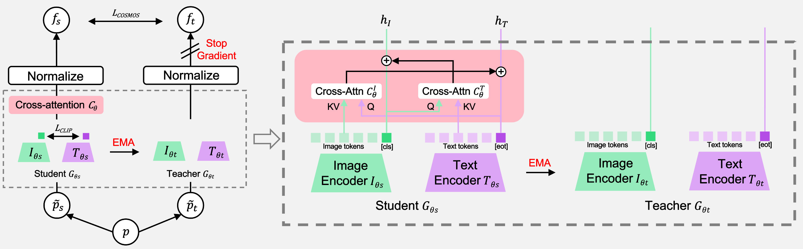
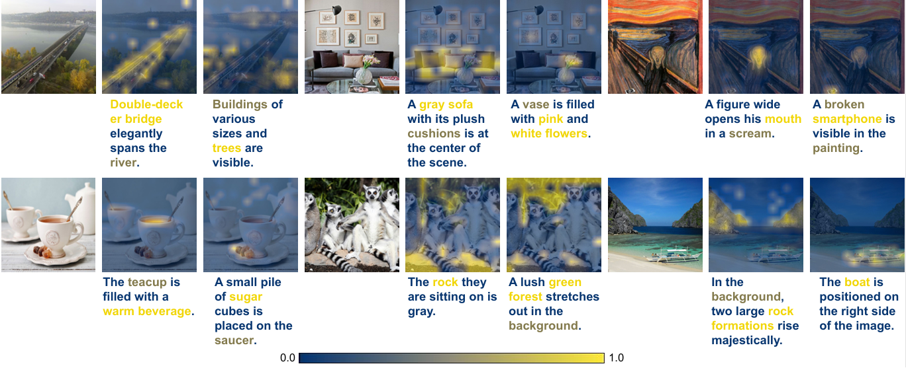

# COSMOS: Cross-Modality Self-Distillation for Vision Language Pre-training [[Arxiv]](https://arxiv.org/abs/2412.01814)

__Authors__: Sanghwan Kim, Rui Xiao, Mariana-Iuliana Georgescu, Stephan Alaniz, Zeynep Akata

### Abstract
Vision-Language Models (VLMs) trained with contrastive loss have achieved significant advancements in various vision and language tasks. However, the global nature of contrastive loss makes VLMs focus predominantly on foreground objects, neglecting other crucial information in the image, which limits their effectiveness in downstream tasks. To address these challenges, we propose COSMOS: CrOSs-MOdality Self-distillation for vision-language pre-training that integrates a novel text-cropping strategy and cross-attention module into a self-supervised learning framework. We create global and local views of images and texts (i.e., multi-modal augmentations), which are essential for self-distillation in VLMs. We further introduce a cross-attention module, enabling COSMOS to learn comprehensive cross-modal representations optimized via a cross-modality self-distillation loss. COSMOS consistently outperforms previous strong baselines on various zero-shot downstream tasks, including retrieval, classification, and semantic segmentation. Additionally, it surpasses CLIP-based models trained on larger datasets in visual perception and contextual understanding tasks. 

## Code and model 🔜
Code and pre-trained models will be released soon. 

## Qualitative Results

We visualize the attention weights of image and text cross-attention modules. Patch-wise (image) and token-wise (caption) attention weights are both normalized between 0 and 1.

